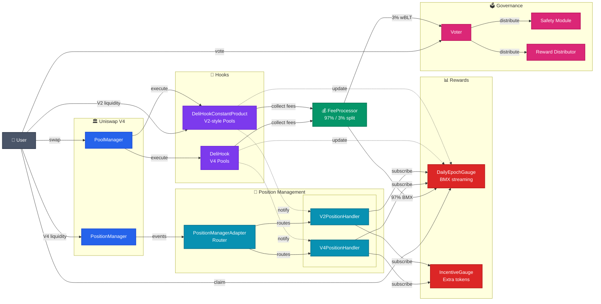
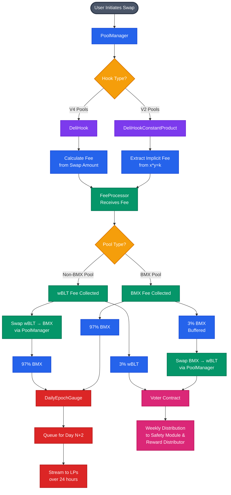
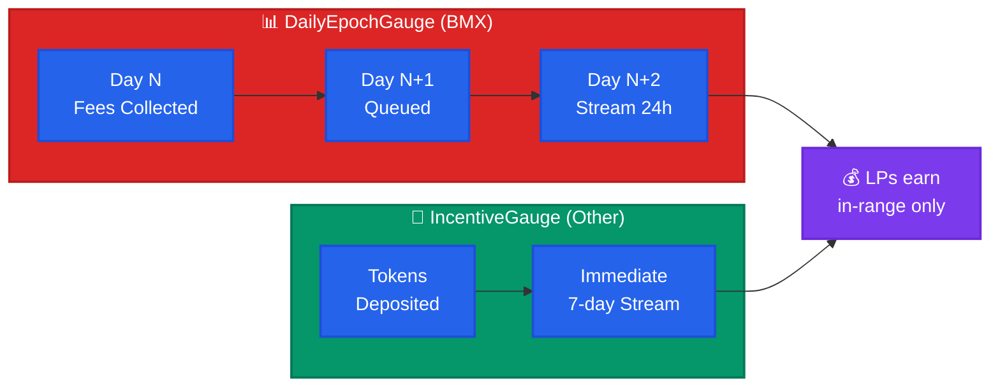

# 🍱 Deli Swap

**A DEX built on Uniswap v4 that implements custom fee distribution, liquidity incentives, and dual AMM models.**

## 🚀 Local Development Setup

```bash
# Install dependencies
forge install

# Build contracts
forge build

# Run tests
forge test

# Run specific test categories
forge test --match-path test/unit/**/*.sol          # Unit tests only
forge test --match-path test/integration/*.sol      # Integration tests
forge test --match-path test/invariant/*.sol        # Invariant tests
forge test --match-path test/constant-product/*.sol # V2 hook tests (contains relevant unit/integration/invariant)
```

## 📋 Table of Contents

- [Overview](#-overview)
- [Key Features](#-key-features)
- [Technical Requirements](#-technical-requirements)
- [Architecture](#-architecture)
- [Project Structure](#-project-structure)
- [Core Contracts](#-core-contracts)
- [Supporting Contracts](#-supporting-contracts)
- [Libraries](#-libraries)
- [Interfaces](#-interfaces)
- [Hook Comparison](#-hook-comparison)
- [System Flows](#-system-flows)
- [Testing](#-testing)
- [Summary](#-summary)

## 🌟 Overview

Deli Swap is a new DeFi protocol that extends Uniswap v4's capabilities with sophisticated fee distribution mechanisms and liquidity incentives. The protocol implements two distinct AMM models:

1. **Concentrated Liquidity (V4-style)**: Through `DeliHook` - maintains Uniswap v4's capital efficiency
2. **Constant Product (V2-style)**: Through `DeliHookConstantProduct` - offers simplified x*y=k pools

Both models integrate with a unified fee distribution system that automatically converts collected fees to BMX tokens and streams them back to liquidity providers over 24-hour epochs.

## 🎯 Key Features

- **Dual AMM Support**: Choice between concentrated liquidity and constant product curves
- **Automated Fee Buybacks**: 97% of fees converted to BMX, 3% to voters (configurable)
- **Range-Aware Rewards**: Only in-range positions earn rewards (even for V2-style full-range)
- **Time-Aligned Epochs**: UTC-based periods (24h for daily rewards, 7d for weekly rewards and voting)
- **Multi-Token Incentives**: Additional reward tokens via IncentiveGauge
- **Modular Architecture**: Extensible handler system for new position types

## 🔧 Technical Requirements

### Pool Requirements

- **All pools**: Must include wBLT token, no native ETH
- **V4 pools**: Standard concentrated liquidity
- **V2 pools**: Tick spacing = 1, min fee 0.1%, full-range only

### Time-Based Systems

- **DailyEpochGauge**: 24-hour UTC epochs with 48-hour delay (3-day pipeline)
- **IncentiveGauge**: 7-day streaming periods
- **Voter**: Weekly epochs starting Tuesday

### Fee Configuration

- **FeeProcessor**: 97% buyback / 3% voter split (configurable)
- **Slippage Protection**: 1% default on buyback swaps
- **Internal Swap Flag**: 0xDE1ABEEF prevents recursive fee collection

### Position Management

- **Position Keys**: Consistent formula: `keccak256(owner, tickLower, tickUpper, tokenId, poolId)`
- **V2 Positions**: Always full-range (tickLower=TickMath.MIN_TICK, tickUpper=TickMath.MAX_TICK)
- **Handler Registration**: Must register handlers with PositionManagerAdapter before use

## 🏗 Architecture



## 📁 Project Structure

```text
src/
├── 🎣 Core Hooks
│   ├── DeliHook.sol                    # V4 concentrated liquidity hook
│   └── DeliHookConstantProduct.sol     # V2-style x*y=k hook
│
├── 💰 Fee & Reward System
│   ├── FeeProcessor.sol                # Fee splitting & BMX buybacks
│   ├── DailyEpochGauge.sol            # 24h epoch reward streaming
│   └── IncentiveGauge.sol             # Additional token incentives
│
├── 🎯 Position Management
│   ├── PositionManagerAdapter.sol      # Unified position interface
│   └── handlers/
│       ├── V2PositionHandler.sol       # V2-style position tracking
│       └── V4PositionHandler.sol       # V4 position tracking
│
├── 🗳 Governance
│   └── Voter.sol                       # Voting & fee distribution
│
├── 🏛 Base Contracts
│   └── base/
│       └── MultiPoolCustomCurve.sol    # Base for custom AMM curves
│
├── 🔧 Libraries
│   └── libraries/
│       ├── DeliErrors.sol              # Custom error definitions
│       ├── InternalSwapFlag.sol        # Internal swap detection
│       ├── Math.sol                    # Math utilities
│       ├── RangePool.sol              # Range-aware pool accounting
│       ├── RangePosition.sol          # Range position tracking
│       └── TimeLibrary.sol            # Time/epoch utilities
│
└── 📋 Interfaces
    └── interfaces/
        ├── IDailyEpochGauge.sol
        ├── IFeeProcessor.sol
        ├── IIncentiveGauge.sol
        ├── IPoolKeys.sol
        ├── IPositionHandler.sol
        ├── IPositionManagerAdapter.sol
        ├── IRewardDistributor.sol
        └── IV2PositionHandler.sol
```

## 📜 Core Contracts

- **[DeliHook](src/README.md#delihook)** - V4 concentrated liquidity hook with fee interception
- **[DeliHookConstantProduct](src/README.md#delihookconstantproduct)** - V2-style x*y=k AMM implementation
- **[DailyEpochGauge](src/README.md#dailyepochgauge)** - BMX reward streaming (24h epochs, 3-day pipeline)
- **[FeeProcessor](src/README.md#feeprocessor)** - Fee collection, 97/3 split, and BMX buyback execution
- **[IncentiveGauge](src/README.md#incentivegauge)** - Additional ERC20 token rewards (7-day streaming)
- **[PositionManagerAdapter](src/README.md#positionmanageradapter)** - ISubscriber event router for position tracking
- **[Voter](src/README.md#voter)** - Weekly voting for protocol revenue distribution

## 🏛 Supporting Contracts

- **[MultiPoolCustomCurve](src/base/README.md)** - Abstract base for custom AMM implementations
- **[V2PositionHandler](src/handlers/README.md)** - Synthetic position tracking for constant product pools
- **[V4PositionHandler](src/handlers/README.md)** - Wrapper for V4 NFT positions

## 📚 Libraries

- **[DeliErrors](src/libraries/README.md#delierrors)** - Custom error definitions for gas-efficient reverts
- **[InternalSwapFlag](src/libraries/README.md#internalswapflag)** - Marker (0xDE1ABEEF) to identify internal buyback swaps
- **[Math](src/libraries/README.md#math)** - Basic utilities (sqrt, min) for AMM calculations
- **[RangePool](src/libraries/README.md#rangepool)** - Tick-aware accumulator for range-based reward distribution
- **[RangePosition](src/libraries/README.md#rangeposition)** - Per-position reward tracking and owner indexing
- **[TimeLibrary](src/libraries/README.md#timelibrary)** - UTC-aligned time utilities for epochs

## 📋 Interfaces

- **[IDailyEpochGauge](src/interfaces/README.md#idailyepochgauge)** - BMX reward streaming with 24-hour epochs
- **[IIncentiveGauge](src/interfaces/README.md#iincentivegauge)** - Additional ERC20 token distribution
- **[IFeeProcessor](src/interfaces/README.md#ifeeprocessor)** - Fee collection and buyback execution
- **[IPositionManagerAdapter](src/interfaces/README.md#ipositionmanageradapter)** - Unified position event routing
- **[IPositionHandler](src/interfaces/README.md#ipositionhandler)** - Base interface for position handlers
- **[IV2PositionHandler](src/interfaces/README.md#iv2positionhandler)** - V2-specific position notifications
- **[IPoolKeys](src/interfaces/README.md#ipoolkeys)** - PoolId to PoolKey reverse lookups
- **[IRewardDistributor](src/interfaces/README.md#irewarddistributor)** - Voter reward configuration

## 🔀 Hook Comparison

| Feature | DeliHook (V4) | DeliHookConstantProduct (V2-style) |
|---------|---------------|-------------------------------------|
| **AMM Model** | Concentrated liquidity | Constant product (x*y=k) |
| **Position Type** | NFT with tick ranges | Fungible shares (mapping) |
| **Fee Collection** | Explicit calculation | Implicit in swap formula |
| **Liquidity Ranges** | Customizable | Full-range only |
| **Pool Fee** | Any | Minimum 0.1% fee |

## 🔄 System Flows

### Swap Fee Collection Flow



### Reward Distribution Timeline



## 🧪 Testing

The test suite is organized into several categories for comprehensive coverage:

### Test Structure

```text
test/
├── 🔄 constant-product/         # V2-style constant product hook tests
│   ├── BufferFlushAndPull_V2    # Fee pipeline integration for V2 pools
│   ├── DeliHookConstantProduct  # Core V2 hook functionality
│   ├── GaugeStream_V2           # V2 position reward streaming
│   ├── LiquidityLifecycle_V2    # V2 liquidity add/remove flows
│   ├── MultiPoolCustomCurve     # Base curve contract tests
│   ├── MultiPool_V2             # Multiple V2 pool interactions
│   └── SwapLifecycle_V2         # V2 swap mechanics and fees
│
├── 🔗 integration/              # End-to-end system tests
│   ├── BufferFlushAndPull       # Fee buffer flushing and buybacks
│   ├── FeeProcessorEdge         # Edge cases in fee processing
│   ├── GaugeStream              # Daily gauge reward streaming
│   ├── InRangeAccounting        # Range-aware reward distribution
│   ├── IncentiveAndDaily        # Combined gauge interactions
│   ├── PositionLifecycleCleanup # Position creation/removal flows
│   ├── ReentrancyFlush          # Reentrancy protection tests
│   └── SwapLifecycle            # Complete swap flows with fees
│
├── 🔒 invariant/                        # Property-based invariant tests
│   ├── DailyEpochGaugeEpochInvariant    # Epoch transition correctness
│   ├── DailyEpochGaugeLongInvariant     # Long-run streaming accuracy
│   ├── FeeProcessorBuffersInvariant     # Buffer accounting consistency
│   ├── IncentiveGaugeFOTInvariant       # Fee-on-transfer token support
│   ├── IncentiveGaugeInvariant          # Standard reward distribution
│   ├── RangePoolBitmapInvariant         # Tick bitmap consistency
│   ├── RangePoolTwoPosInvariant         # Two-position interactions
│   ├── RewardAccountingInvariant        # Total reward conservation
│   ├── VoterGasInvariant                # Gas usage boundaries
│   └── VoterInvariant                   # Voting state consistency
│
├── 🧩 unit/                     # Isolated unit tests by contract
│   ├── DailyEpochGauge/         # Claim, epoch, storage, updates
│   ├── DeliHook/                # Hook callbacks, fees, edge cases
│   ├── FeeProcessor/            # Collection, swaps, configuration
│   ├── IncentiveGauge/          # Streaming, storage, views
│   ├── Libraries/               # RangePool, RangePosition, Time
│   └── Voter/                   # Deposit, vote, finalize flows
│
├── 🎭 mocks/                    # Mock contracts for testing
│
└── 🛠 utils/                     # Test helpers and utilities
```

## 🎯 Summary

Deli Swap extends Uniswap v4 with automated fee distribution, creating a self-sustaining ecosystem where:

- Swap fees are automatically converted to BMX tokens
- BMX streams to liquidity providers over 24-hour epochs
- Only in-range positions earn rewards (V2-style pools are always full-range)
- Additional incentive tokens can be layered on top

### Future Extensibility

The protocol's modular design allows for:

- Additional AMM curves (extend MultiPoolCustomCurve)
- New position types (implement IPositionHandler)
- Alternative reward tokens (via IncentiveGauge)
- Custom voting options (configure Voter)

---
